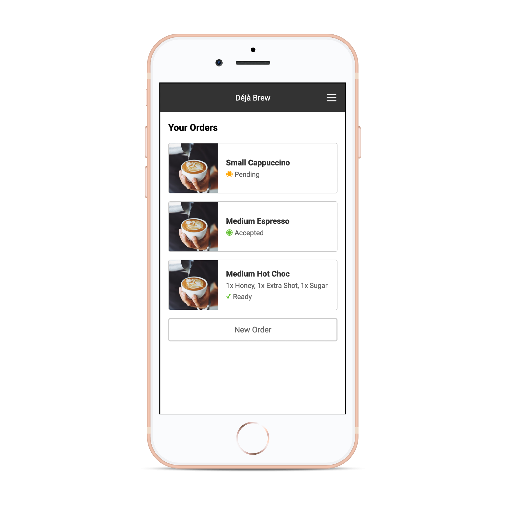

# deja-brew
Déjà Brew - A web based coffee ordering system



## Development (local)

### Local dependencies

```
docker-compose -f production/local/docker-compose.yaml up
```

### Python backend

```
cd backend
pipenv shell && pipenv install
cp env.example.sh env.sh
# Modify env.sh with relevant environment variables
source env.sh
```

**Without SSL:**

```
FLASK_APP=deja_brew flask run --reload --debugger
```

Access site at [http://localhost:5000](http://localhost:5000)

**With SSL**
Required when needing to test Google Oauth

```
FLASK_APP=deja_brew flask run --reload --debugger --cert adhoc
``` 

Access site at [https://localhost:5000](https://localhost:5000)

### React frontend

```
cd frontend
npm start
```

Access "fake" (detached) mode by visiting [http://localhost:3000/](http://localhost:3000/). 
Alternatively the backend will reference assets from the webpack server by default. 

## Deployment (production)

### Build container
This script will:

* Build the frontend
* Deploy production static assets to the backend
* Build the backend "nickw444/deja_brew" container, tagged with the current commit SHA
* Push the newly built container to the [Docker Hub](https://hub.docker.com/r/nickw444/deja_brew)

```
./production/bin/build_container.sh
```

### Deploy container

This script will deploy the container to Amazon Elastic Beanstalk. It will create a new deployment 
for the docker container tagged with the current commit SHA 

```
./production/bin/deploy.sh
```

### Misc

* Installing python mysqlclient library on OSX: [https://ruddra.com/posts/install-mysqlclient-macos/](https://ruddra.com/posts/install-mysqlclient-macos/)

### To-do

- [ ] Better solution for configuration. `config.py` is way to verbose.
- [ ] Secrets management instead of environment variables. 
- [ ] Lint code and format with black
- [ ] Lint and format frontend code with prettier
